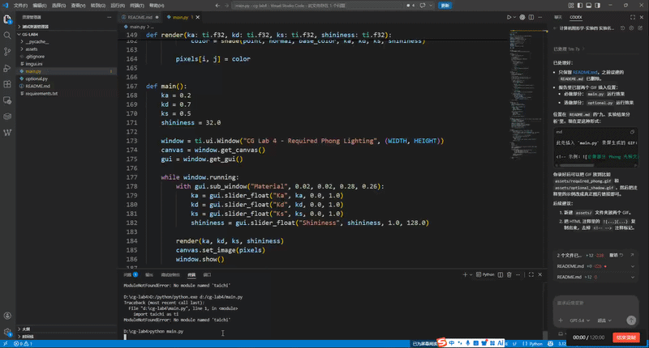
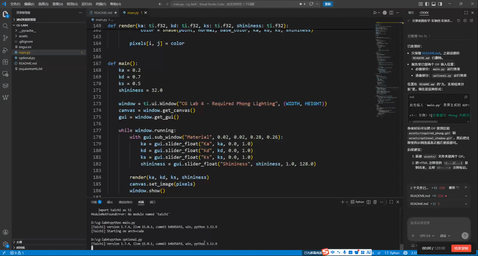

# 计算机图形学实验四：Phong 光照模型

## 一、实验信息

- 实验名称：Phong 光照模型
- 授课教师：张鸿文
- 助教：张怡冉
- 课程主页：https://zhanghongwen.cn/cg

## 二、实验目标

本实验使用 Taichi 编写一个基于光线投射的交互式局部光照渲染程序。程序不依赖外部模型文件，而是在 Kernel 中通过数学隐式表达式定义球体与圆锥，并在每个像素上发射射线完成求交、深度测试和着色。

代码分为两个入口文件，便于区分必做和选做：

- `main.py`：必做版本，实现标准 Phong 光照模型。
- `optional.py`：选做版本，实现 Blinn-Phong 高光模型和硬阴影。

实验主要完成以下目标：

- 理解环境光、漫反射和镜面高光在局部光照模型中的作用。
- 掌握射线、法向量、光照方向、观察方向、反射向量和半程向量的计算方法。
- 使用 Taichi 的 `ti.ui.Window` 创建交互窗口，通过滑动条实时调节材质参数。
- 完成选做内容：Blinn-Phong 高光模型和硬阴影。

## 三、运行方式

安装依赖：

```bash
pip install -r requirements.txt
```

运行必做版本：

```bash
python main.py
```

运行选做版本：

```bash
python optional.py
```

程序运行后会显示一个交互窗口，其中包含红色球体、紫色圆锥和材质参数面板。面板提供四个滑动条：

- `Ka`：环境光系数，范围 `0.0 ~ 1.0`，默认值 `0.2`
- `Kd`：漫反射系数，范围 `0.0 ~ 1.0`，默认值 `0.7`
- `Ks`：镜面高光系数，范围 `0.0 ~ 1.0`，默认值 `0.5`
- `Shininess`：高光指数，范围 `1.0 ~ 128.0`，默认值 `32.0`

说明：如果当前环境提示没有 Taichi，请确认安装和运行使用的是同一个 Python 解释器，例如使用 `python -m pip install -r requirements.txt` 安装依赖后，再使用同一个 `python` 运行脚本。

## 四、场景构建

本实验的场景完全由代码生成：

- 摄像机位置：`(0, 0, 5)`
- 点光源位置：`(2, 3, 4)`
- 光源颜色：`(1.0, 1.0, 1.0)`
- 背景颜色：深青色
- 红色球体：
  - 球心：`(-1.2, -0.2, 0)`
  - 半径：`1.2`
  - 基础颜色：`(0.8, 0.1, 0.1)`
- 紫色圆锥：
  - 顶点：`(1.2, 1.2, 0)`
  - 底面高度：`y = -1.4`
  - 底面半径：`1.2`
  - 基础颜色：`(0.6, 0.2, 0.8)`

屏幕中每个像素都会从摄像机位置生成一条射线。射线方向由像素坐标映射到视平面后归一化得到。

## 五、射线求交与深度测试

### 1. 球体求交

球体使用标准隐式方程：

```text
|P - C|^2 = r^2
```

将射线：

```text
P(t) = O + tD
```

代入球体方程后得到一元二次方程。程序计算判别式并取最小的正交点距离 `t`。交点法向量为：

```text
N = normalize(P - C)
```

### 2. 圆锥求交

圆锥沿 `y` 轴放置，顶点在上方，底面在下方。局部坐标为：

```text
q = P - apex
```

侧面隐式方程为：

```text
q.x^2 + q.z^2 - k^2 q.y^2 = 0
k = radius / height
```

求得候选交点后，还需要检查交点的 `y` 坐标是否位于 `[base_y, apex_y]` 范围内。圆锥底面作为圆盘单独求交，若射线击中底面圆盘且距离更近，则使用底面交点。

圆锥侧面法向量使用隐式函数梯度：

```text
N = normalize((q.x, -k^2 q.y, q.z))
```

底面法向量为：

```text
N = (0, -1, 0)
```

### 3. 深度竞争

程序分别计算射线与球体、圆锥的交点距离，并使用类似 Z-buffer 的逻辑选取最小正数 `t`：

```text
t_min = min(t_sphere, t_cone)
```

只有最近交点会进入着色阶段，因此当两个物体在屏幕空间中重叠时，能得到正确的遮挡关系。

## 六、光照模型

原始 Phong 模型将最终光照分为三部分：

```text
I = I_ambient + I_diffuse + I_specular
```

### 1. 环境光

```text
I_ambient = Ka * C_light * C_object
```

环境光模拟场景中均匀分布的背景光，和法向量方向无关。

### 2. 漫反射

```text
I_diffuse = Kd * max(0, N dot L) * C_light * C_object
```

其中 `N` 是单位法向量，`L` 是从交点指向光源的单位方向。`max(0, N dot L)` 用于截断背光面的负值。

### 3. 镜面高光

基础 Phong 模型使用反射向量 `R` 与观察方向 `V` 的夹角计算高光：

```text
I_specular = Ks * max(0, R dot V)^n * C_light
```

`main.py` 中使用该标准 Phong 公式作为必做部分实现。`optional.py` 中则把高光计算替换为 Blinn-Phong 模型，用于完成选做内容。

## 七、选做内容

### 1. Blinn-Phong 模型

Blinn-Phong 使用半程向量 `H` 替代 Phong 模型中的理想反射向量：

```text
H = normalize(L + V)
I_specular = Ks * max(0, N dot H)^n * C_light
```

相比传统 Phong，Blinn-Phong 的高光通常更加稳定，高光区域边缘更平滑。在大入射角情况下，Phong 模型依赖理想反射方向与观察方向的夹角，可能出现高光快速消失或边缘变化较突兀的问题；Blinn-Phong 使用半程向量后，高光过渡通常更连续，也更适合实时渲染中使用。

### 2. 硬阴影

`optional.py` 在主射线命中物体后，从交点沿光源方向发射一条暗影射线：

```text
shadow_ray_origin = point + L * epsilon
shadow_ray_direction = L
```

如果暗影射线在到达光源前与任意物体相交，则认为该交点位于阴影中。阴影区域只保留环境光：

```text
color = I_ambient
```

为了避免暗影射线再次命中当前表面造成自遮挡，代码对暗影射线起点沿光照方向进行了一个很小的偏移。

## 八、关键代码说明

代码入口分为 `main.py` 和 `optional.py`。`main.py` 对应必做内容，`optional.py` 对应选做内容。

- `hit_sphere()`：计算射线与球体的最近正交点，并返回法向量。
- `hit_cone()`：计算射线与圆锥侧面和底面的交点，并返回最近交点法向量。
- `nearest_hit()`：完成球体和圆锥之间的深度竞争。
- `in_shadow()`：仅在 `optional.py` 中使用，实现硬阴影检测。
- `shade()`：在 `main.py` 中计算标准 Phong 光照，在 `optional.py` 中计算 Blinn-Phong 高光并处理阴影。
- `render()`：对每个像素发射射线，完成求交、着色和颜色裁剪。
- `main()`：创建 Taichi UI 窗口和滑动条，实现实时交互。

## 九、实验结果分析

### 1. 必做部分运行效果

此处插入 `main.py` 录屏生成的 GIF：



调节 `Ka` 时，整个物体的基础亮度会同步变化。`Ka` 较小时，背光区域接近黑色；`Ka` 增大后，阴影和背光面仍能保持可见。

调节 `Kd` 时，物体受光面的明暗层次会明显变化。`Kd` 越大，面向光源的区域越亮，Lambert 漫反射效果越明显。

调节 `Ks` 时，高光强度变化明显。`Ks` 较小时，高光不明显；`Ks` 增大后，球体和圆锥受光区域会出现更强的白色高光。

调节 `Shininess` 时，高光范围会变化。较小的高光指数产生更宽、更柔和的高光；较大的高光指数会产生更集中、更锐利的高光。

### 2. 选做部分运行效果

此处插入 `optional.py` 录屏生成的 GIF：



运行 `optional.py` 开启硬阴影后，被其他物体遮挡光源的区域只计算环境光，因此能够看到明确的阴影边界。这说明额外的暗影射线可以有效判断光源可见性。

## 十、总结

本实验完成了一个基于 Taichi 的交互式光线投射渲染器。程序通过隐式几何方程生成红色球体和紫色圆锥，对每个像素进行射线求交，并通过最近正交点选择实现深度测试。`main.py` 完成标准 Phong 光照必做内容，`optional.py` 进一步完成 Blinn-Phong 高光和硬阴影两个选做内容。

通过本实验可以直观观察 `Ka`、`Kd`、`Ks` 和 `Shininess` 对最终渲染效果的影响，加深对局部光照模型和实时交互式渲染流程的理解。
